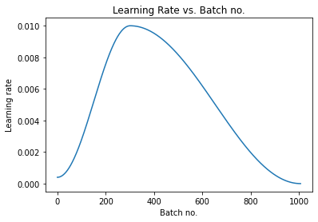

# Indian_Sign_Luanguage_to_Audio

Introduction
Our project is an effort towards studying the challenges in the classification of characters in Indian Sign Language(ISL). It aims at taking the basic step in bridging the communication gap between normal people and deaf and dumb people using Indian sign language. The idea of our -project is to design a system that can interpret the Indian sign language in the domain of numerals accurately so that the less fortunate people will be able to communicate with the outside world without the need for an interpreter in public places like railway stations, banks, etc.
The Dataset of our project contains 43,200 images, and a total of 26 alphabets (A-Z) and Single Digit Numbers (0-9) are taken into consideration for overall training and testing of the model. We have used a CNN Model for the prediction of the alphabet and/or numbers. Training of CNN is done with the help of the ReLu activation function, and we have plotted graphs to check improvement in the model. After the prediction, we converted the output to audio format.

 
Figure 1: Indian Sign Language

Methodology

Figure 2: Flow Chart

1. Preparing the Dataset  
Prepared dataset using openCV python libarary in real time. The Dataset of our project contains 43,200 images, and a total of 26 alphabets (A-Z) and Single Digit Numbers (0-9) are taken into consideration for overall training and testing of the model  
                                                                                                
2. Batch-wise evaluation of the image dataset
 The show_batch function is is used to evaluate images batch wise. It will print a batch of 64 images from the dataset.

3. Creating training and validation dataset
In this step we create training and validation datasets using the `ImageFolder` class from `torchvision`. In addition to the `ToTensor` transform, we also apply some other transforms to the images. There are a few important changes made while creating PyTorch datasets for training and validation:
•	Channel-wise data normalization
We will normalize the image tensors by subtracting the mean and dividing by the standard deviation across each channel. As a result, the mean of the data across each channel is 0, and standard deviation is 1. Normalizing the data prevents the values from any one channel from disproportionately affecting the losses and gradients while training, simply by having a higher or wider range of values that others.

 

•	Randomized data augmentations
We will apply randomly chosen transformations while loading images from the training dataset. Specifically, we will pad each image by 4 pixels, and then take a random crop of size 32 x 32 pixels, and then flip the image horizontally with a 50% probability. Since the transformation will be applied randomly and dynamically each time a particular image is loaded, the model sees slightly different images in each epoch of training, which allows it generalize better

Figure  : Normalized and Augmented Image

4. Using a GPU
To use a GPU available, we define a couple of helper functions (get_default_device & to_device) and a helper class DeviceDataLoader to move our model & data to the GPU as required.
5. Adding Residual Block & Normalization
Model with Residual Blocks and Batch Normalization
One of the key changes to our CNN model is the addition of the residual block, which adds the original input back to the output feature map obtained by passing the input through one or more convolutional layers. ResNet9 Architecture is used for ReLu function.
 
Figure : ReLu Function (Rectified Linear Fuction)
A residual connection connects the output of one earlier convolutional layer to the input of another future convolutional layer several layers later (e.g. a numer of intermediate convolutional steps are skipped). The input of the mainstream model and the input of the convolutional prior are combined using a simple sum.
6. Training the model
In training our model, instead of SGD (stochastic gradient descent), we've used the Adam optimizer which uses techniques like momentum and adaptive learning rates for faster training. There are total of 8 epochs, and our model is trained to 100% accuracy in 10 minutes.
 
Figure: Training our Model
7. Plotting validation set
We plot the training and validation losses to study the trend.
 
Figure : 
The learning rate starts at a low value, and gradually increases for 30% of the iterations to a maximum value of 0.01, and then gradually decreases to a very small value.
 
Figure : Learning Rate
8. Testing with individual image
Predicting single image with the “predict image ( )” function.
 
9. Converting to Audio
Using the pyttsx3 library in python, we convert the output predicted in audio format. 
 
